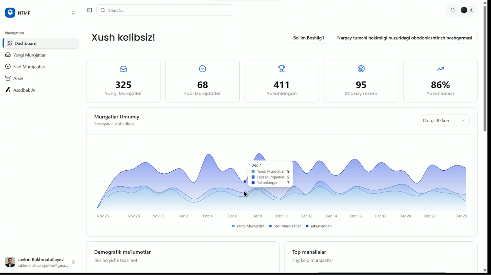

# NTMP - Narpay Tumani Murojaatlari Portali

**AI-Powered Government Messaging Platform**

A comprehensive civic support platform that bridges citizens and district government departments through intelligent message routing, real-time communication, and AI-powered department assignment.

<!-- TODO: Add dashboard preview image -->

*Staff Dashboard Interface - Add screenshot here*

<!-- TODO: Add bot interface preview image -->

*Telegram Bot Interface - Add screenshot here*

---

## 📋 Table of Contents

- [Overview](#overview)
- [Features](#features)
- [Architecture](#architecture)
- [Tech Stack](#tech-stack)
- [Project Structure](#project-structure)
- [Prerequisites](#prerequisites)
- [Installation](#installation)
- [Configuration](#configuration)
- [Usage](#usage)
- [API Documentation](#api-documentation)
- [Development](#development)
- [Testing](#testing)
- [Deployment](#deployment)
- [Contributing](#contributing)
- [License](#license)

---

## 🎯 Overview

NTMP (Narpay Tumani Murojaatlari Portali) is a modern messaging platform designed for district governments to efficiently handle citizen inquiries, complaints, and requests. The system uses AI-powered semantic search and classification to automatically route messages to the appropriate government department, ensuring citizens receive timely and accurate responses.

### Key Capabilities

- **Multi-Channel Support**: Citizens can submit requests via Telegram bot or web interface
- **AI-Powered Routing**: Automatic department assignment using semantic search and LLM validation
- **Real-Time Communication**: WebSocket-based chat interface for staff-citizen interactions
- **Intelligent Learning**: Feedback loop system that learns from routing corrections
- **Comprehensive Dashboard**: Staff dashboard for managing sessions, tickets, and analytics
- **Security First**: Injection detection, authentication, and secure message handling

---

## ✨ Features

### For Citizens
- 📱 **Telegram Bot Integration**: Submit requests directly from Telegram
- 🌐 **Web Interface**: User-friendly web portal for submitting appeals
- 🔐 **Phone-Based Authentication**: Secure OTP verification system
- 📊 **Request Tracking**: View status of submitted requests
- 🤖 **Asadbek AI**: Interactive AI assistant for inquiries
- 🌍 **Multi-Language Support**: Uzbek and Russian language support

### For Staff
- 📊 **Dashboard Overview**: Real-time statistics and metrics
- 📥 **Unassigned Tickets**: Queue of new requests waiting for assignment
- ✅ **Assigned Sessions**: Active sessions assigned to staff members
- 🏁 **Archive**: Historical record of closed sessions
- 🔎 **Global Search**: Search across all sessions and messages
- 💬 **Real-Time Chat**: Live messaging interface with citizens
- 📈 **Performance Analytics**: Response times, completion rates, and leaderboards
- 🔔 **Notifications**: Real-time notifications for new messages and escalations

### System Features
- 🧠 **AI Classification**: Gemini-powered intent detection and department routing
- 🔍 **Semantic Search**: Qdrant vector database for intelligent message matching
- 🛡️ **Injection Detection**: Security layer to detect and quarantine malicious inputs
- 🔄 **Dynamic Learning**: Vector upsert system that learns from corrections
- ⚡ **Async Processing**: Celery + Redis for background task processing
- 📡 **WebSocket Support**: Real-time bidirectional communication
- 🔐 **JWT Authentication**: Secure API authentication
- 📝 **Comprehensive Logging**: Detailed logs for debugging and monitoring

---

## 🏗️ Architecture

The platform follows a microservices architecture with clear separation of concerns:

```
┌─────────────────────────────────────────────────────────────┐
│                    Citizen Interface                         │
│  ┌──────────────┐              ┌──────────────┐            │
│  │ Telegram Bot │              │  Web Portal  │            │
│  └──────┬───────┘              └──────┬───────┘            │
└─────────┼────────────────────────────┼──────────────────────┘
          │                            │
          └────────────┬───────────────┘
                       │
          ┌────────────▼──────────────┐
          │   Django Backend API      │
          │  - Session Management     │
          │  - Authentication          │
          │  - Message Handling       │
          │  - WebSocket Server       │
          └────────────┬───────────────┘
                       │
          ┌────────────▼──────────────┐
          │  FastAPI Microservice     │
          │  - Language Detection     │
          │  - Injection Detection    │
          │  - Semantic Search        │
          │  - LLM Classification     │
          └────────────┬───────────────┘
                       │
          ┌────────────▼──────────────┐
          │   Vector Database (Qdrant)│
          │   - Department Embeddings │
          │   - Semantic Search       │
          └───────────────────────────┘
                       │
          ┌────────────▼──────────────┐
          │   Staff Dashboard (Next.js)│
          │   - Session Management    │
          │   - Real-time Chat        │
          │   - Analytics & Reports   │
          └───────────────────────────┘
```

### Data Flow

1. **Message Submission**: Citizen submits message via Telegram or web
2. **Session Creation**: Django creates/updates session and saves message
3. **AI Processing**: If department not assigned, message sent to FastAPI microservice
4. **Language Detection**: Detects message language (Uzbek/Russian)
5. **Security Check**: Injection detection filters malicious content
6. **Semantic Search**: Qdrant finds top 3 matching departments
7. **LLM Validation**: Gemini selects best department with confidence score
8. **Department Routing**: Message routed to appropriate department dashboard
9. **Staff Notification**: Department staff notified via Telegram and dashboard
10. **Session Management**: Staff assigns themselves and handles the session

---

## 🛠️ Tech Stack

### Backend
- **Django 5.2.9**: Main backend framework
- **Django REST Framework**: RESTful API
- **Django Channels**: WebSocket support for real-time communication
- **Celery**: Asynchronous task processing
- **MySQL 8.4**: Primary relational database
- **Redis**: Caching and Celery broker
- **JWT (SimpleJWT)**: Authentication

### AI/ML Microservice
- **FastAPI**: High-performance async API framework
- **Google Gemini**: LLM for classification and validation
- **Qdrant**: Vector database for semantic search
- **Text Embedding**: Gemini text-embedding-004 model

### Frontend
- **Next.js 16.0.10**: React framework
- **TypeScript**: Type-safe development
- **Tailwind CSS**: Utility-first CSS framework
- **Shadcn/ui**: UI component library
- **Lucide React**: Icon library
- **Radix UI**: Accessible component primitives

### Infrastructure
- **Docker & Docker Compose**: Containerization
- **Nginx**: Reverse proxy (production)
- **WebSocket**: Real-time bidirectional communication

---

## 📁 Project Structure

```
Multiback/
├── django_backend/          # Django backend application
│   ├── api/                 # API endpoints
│   ├── bot/                 # Telegram bot handlers
│   ├── departments/         # Department management
│   ├── message_app/         # Sessions and messages
│   ├── users/               # User management
│   ├── websockets/          # WebSocket consumers
│   ├── support_tools/       # Utilities (OTP, neighborhoods)
│   ├── ai_endpoints/        # AI analysis tracking
│   ├── broadcast/           # System announcements
│   └── graveyard/           # Project settings
│
├── fastapi_microservice/    # AI/ML processing service
│   ├── api/v1/             # API routes
│   ├── services/            # Business logic
│   └── tests/               # Test suite
│
├── node_frontend/           # Next.js frontend
│   ├── app/                 # Next.js app router
│   ├── components/          # React components
│   ├── contexts/            # React contexts
│   └── public/              # Static assets
│
├── containers/              # Container data volumes
│   ├── mysql_data/         # MySQL data
│   ├── redis_data/          # Redis data
│   └── qdrant_storage/      # Qdrant vector data
│
├── sql/                     # SQL scripts
│   └── insert_department.sql
│
├── docs/                    # Documentation
│   ├── images/              # Screenshots and diagrams
│   └── *.md                 # Documentation files
│
├── elements/                # Design assets
│   ├── reference/           # Design reference images
│   ├── svg_files/           # SVG icons
│   └── link_preview/        # Social media assets
│
├── docker-compose.yml       # Docker orchestration
└── README.md               # This file
```

---

## 📦 Prerequisites

Before you begin, ensure you have the following installed:

- **Docker** (version 20.10+)
- **Docker Compose** (version 2.0+)
- **Python** 3.12+ (for local development)
- **Node.js** 18+ and **npm** (for frontend development)
- **Git**

### Required API Keys

- **Google Gemini API Key**: For AI classification and embeddings
- **Telegram Bot Token**: For Telegram bot integration

---

## 🚀 Installation

### 1. Clone the Repository

```bash
git clone <repository-url>
cd Multiback
```

### 2. Environment Configuration

Create a `.env` file in the `django_backend/` directory:

```bash
cd django_backend
cp .env.example .env  # If example exists, or create manually
```

Required environment variables:

```env
# Django Settings
SECRET_KEY=your-secret-key-here
DEBUG=False
ALLOWED_HOSTS=localhost,127.0.0.1,yourdomain.com

# Database
DB_NAME=gov_db
DB_USER=root
DB_PASSWORD=your-mysql-password
DB_HOST=localhost
DB_PORT=3306

# Redis
REDIS_HOST=127.0.0.1
REDIS_PORT=6379

# AI/ML
GEMINI_API_KEY=your-gemini-api-key

# Telegram
TOKEN_BOT=your-telegram-bot-token
TELEGRAM_BOT_TOKEN=your-telegram-bot-token

# FastAPI Microservice
AI_MICROSERVICE_URL=http://localhost:8001/api/v1

# CORS (for frontend)
CORS_ALLOWED_ORIGINS=http://localhost:3000,https://yourdomain.com
```

### 3. Start Docker Containers

```bash
# Start all services
docker-compose up -d

# Check status
docker-compose ps

# View logs
docker-compose logs -f
```

This will start:
- MySQL (port 3306)
- Redis (port 6379)
- Qdrant (ports 6333, 6334)

### 4. Database Setup

```bash
cd django_backend

# Run migrations
python manage.py migrate

# Create superuser (optional)
python manage.py createsuperuser

# Insert departments
python manage.py insert_departments

# Index departments in Qdrant (for semantic search)
python manage.py index_departments
```

### 5. Start Django Backend

```bash
cd django_backend

# Install dependencies (if not using Docker)
pip install -r requirements.txt

# Run development server
python manage.py runserver

# In separate terminal, start Celery worker
celery -A graveyard worker -l info

# Start Celery beat (for scheduled tasks)
celery -A graveyard beat -l info
```

### 6. Start FastAPI Microservice

```bash
cd fastapi_microservice

# Install dependencies
pip install -r requirements.txt

# Run development server
uvicorn main:app --reload --port 8001
```

### 7. Start Next.js Frontend

```bash
cd node_frontend

# Install dependencies
npm install

# Run development server
npm run dev
```

The frontend will be available at `http://localhost:3000`

---

## ⚙️ Configuration

### Database Configuration

The project uses MySQL with a custom database backend that handles automatic reconnection. Connection settings are configured in `django_backend/graveyard/settings.py`.

### Qdrant Vector Database

Qdrant is used for semantic search. The collection is automatically created with:
- Vector size: 768 (Gemini text-embedding-004)
- Distance metric: Cosine similarity

### Celery Configuration

Celery is configured to use Redis as both broker and result backend. Tasks are defined in:
- `django_backend/message_app/tasks.py`
- `django_backend/websockets/tasks.py`

### WebSocket Configuration

WebSocket support is provided via Django Channels with ASGI. The ASGI application is configured in `django_backend/graveyard/asgi.py`.

---

## 📖 Usage

### For Citizens

#### Via Telegram Bot
1. Search for the bot on Telegram
2. Start a conversation with `/start`
3. Send your message or inquiry
4. Receive automatic routing to appropriate department
5. Chat with department staff in real-time

#### Via Web Portal
1. Visit the web portal
2. Click "Send an Appeal"
3. Authenticate with phone number (OTP verification)
4. Submit your message
5. Track status in "Mening Murojaatlarim" section

### For Staff

1. **Login**: Access staff dashboard
2. **Dashboard**: View overview statistics
3. **Unassigned**: Browse and claim new tickets
4. **Assigned**: Manage your active sessions
5. **Chat**: Communicate with citizens in real-time
6. **Close Session**: Mark sessions as resolved

### Department Routing

The system automatically routes messages using:
1. **Language Detection**: Identifies Uzbek or Russian
2. **Injection Detection**: Filters malicious content
3. **Semantic Search**: Finds top 3 matching departments
4. **LLM Validation**: Gemini selects best match
5. **Confidence Scoring**: Provides routing confidence

---

## 📚 API Documentation

### Django REST API

Base URL: `http://localhost:8000/api/`

Key endpoints:
- `POST /api/appeals/create/` - Create new appeal
- `GET /api/appeals/` - List user appeals
- `GET /api/dashboard/stats/` - Dashboard statistics
- `GET /api/sessions/` - List sessions
- `POST /api/sessions/{id}/assign/` - Assign session to staff
- `POST /api/sessions/{id}/close/` - Close session
- `GET /api/messages/{session_id}/` - Get session messages
- `POST /api/messages/send/` - Send message

### FastAPI Microservice

Base URL: `http://localhost:8001/api/v1/`

Key endpoints:
- `POST /analyze` - Analyze message and route to department
- `POST /detect-language` - Detect message language
- `POST /detect-injection` - Check for injection attacks
- `POST /embed` - Generate embeddings
- `POST /semantic-search` - Search similar departments

### WebSocket

WebSocket URL: `ws://localhost:8000/ws/`

Channels:
- `session.{session_id}` - Session-specific messages
- `staff.{staff_id}` - Staff notifications

---

## 💻 Development

### Code Style

- **Python**: Follow PEP 8, use Black for formatting
- **TypeScript**: Follow ESLint rules, use Prettier
- **Django**: Follow Django best practices

### Running Tests

```bash
# Django tests
cd django_backend
python manage.py test

# Or use pytest
pytest tests/

# FastAPI tests
cd fastapi_microservice
pytest tests/

# Frontend tests (if configured)
cd node_frontend
npm test
```

### Database Migrations

```bash
# Create migrations
python manage.py makemigrations

# Apply migrations
python manage.py migrate
```

### Seeding Data

```bash
# Seed departments
python manage.py insert_departments

# Seed test data
python manage.py seed_data

# Seed quick replies
python manage.py seed_quick_replies
```

---

## 🧪 Testing

The project includes comprehensive test suites:

- **Django Backend**: Unit and integration tests in `django_backend/tests/`
- **FastAPI**: API endpoint tests in `fastapi_microservice/tests/`
- **Coverage**: Test coverage reports available

Run all tests:
```bash
cd django_backend
python run_tests.py --all
```

---

## 🚢 Deployment

### Production Checklist

- [ ] Set `DEBUG=False` in environment
- [ ] Configure `ALLOWED_HOSTS` properly
- [ ] Use strong `SECRET_KEY`
- [ ] Set up SSL/TLS certificates
- [ ] Configure production database
- [ ] Set up proper logging
- [ ] Configure backup strategy
- [ ] Set up monitoring and alerts
- [ ] Review security settings
- [ ] Configure CORS properly

### Docker Production

```bash
# Build production images
docker-compose -f docker-compose.prod.yml build

# Start production services
docker-compose -f docker-compose.prod.yml up -d
```

### Environment Variables

Ensure all production environment variables are set securely, preferably using a secrets management system.

---

## 🤝 Contributing

Contributions are welcome! Please follow these steps:

1. Fork the repository
2. Create a feature branch (`git checkout -b feature/amazing-feature`)
3. Commit your changes (`git commit -m 'Add some amazing feature'`)
4. Push to the branch (`git push origin feature/amazing-feature`)
5. Open a Pull Request

### Development Guidelines

- Write clear commit messages
- Add tests for new features
- Update documentation as needed
- Follow code style guidelines
- Ensure all tests pass

---

## 📄 License

Restring License

---

## 📞 Support

For support, please contact https://t.me/nathan_2net or open an issue in the repository.

---

## 🙏 Acknowledgments

- Google Gemini for AI capabilities
- Qdrant for vector search
- Django, FastAPI, and Next.js communities
- All contributors to this project

---

## 📝 Changelog

### Version 1.0.0
- Initial release
- Core messaging functionality
- AI-powered routing
- Staff dashboard
- Telegram bot integration
- Web portal

---

**Last Updated**: December 2024

**Project Status**: Active Development

